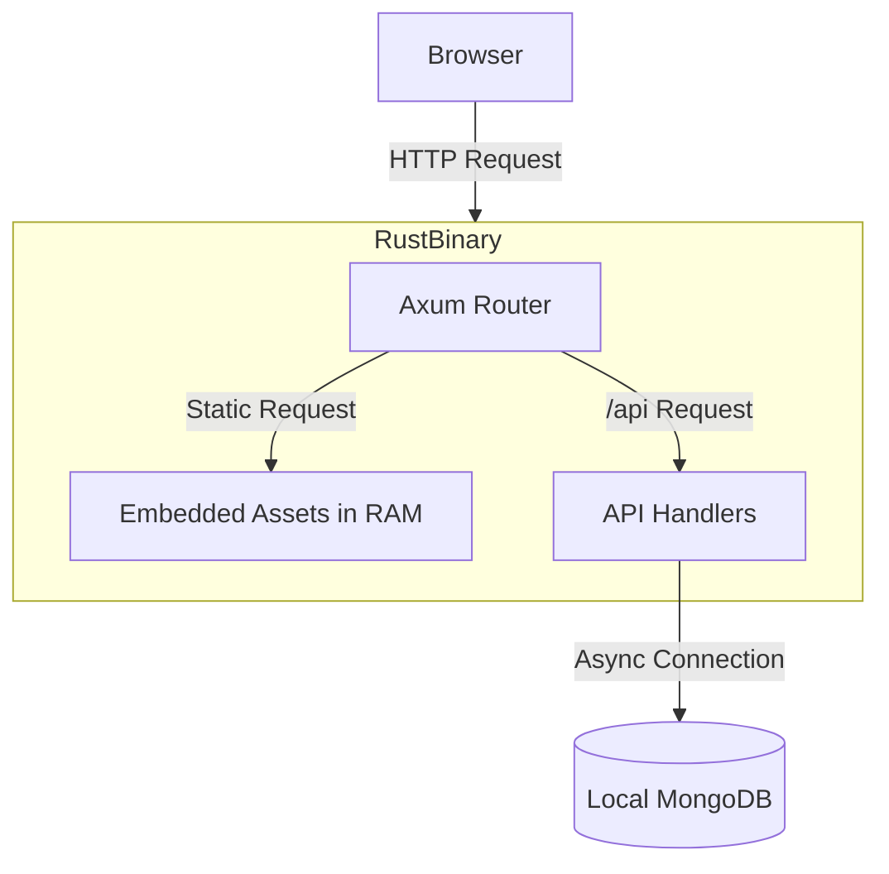

# Architecture & "RAM-Only" Serving

## 🧠 Is it really running from RAM?

**Yes.** Absolutely.

Normally, a web server (like Nginx or Node.js) works like this:

1. Request for `style.css` arrives.
2. Server asks the **SSD/HDD** for the file.
3. SSD/HDD reads the data and hands it to the server.
4. Server sends it to the user.

**Your Rust app works like this:**

1. Request for `style.css` arrives.
2. The server looks at a specific **memory address (RAM)** inside its own process where the bytes for `style.css` were already loaded when the app started.
3. Server sends those bytes directly to the user.

### Why this happens:

The `rust-embed` crate takes your `frontend/dist` files and converts them into constant byte arrays (`&'static [u8]`) at **compile time**. These bytes become part of the binary’s "Data Section". When the OS "runs" your program, it maps the entire binary into RAM.

### Proof:

If you delete the `frontend/dist` folder while the app is running (or even before you run the binary), the app will **still serve the frontend perfectly**. It has no dependency on those external files anymore!

---

### ⚠️ The "Debug" vs "Release" Rule

In Rust, there is a big difference between a **Debug** build and a **Release** build:

1.  **Debug Build (`cargo run`)**: `rust-embed` is smart. It **reads from your disk** while you are coding. This way, you don't have to wait for a 2-minute re-compile every time you change a single CSS color.
2.  **Release Build (`cargo build --release`)**: This is the **Production** version. It performs the "Baking" and loads everything into **RAM**.

---

## 🔬 Laboratory Proofs

If you want to verify the RAM-only behavior, you **must** use a release build:

### 1. The "Release Mode" Test

1. Build the production version:
   ```bash
   cd backend && cargo build --release
   ```
2. **Delete the folder**: `rm -rf ../frontend/dist`
3. Run the production binary: `./target/release/backend`
4. **Result**: Open [http://localhost:8080](http://localhost:8080). **IT WORKS!** Even with the folder deleted, the production binary carries the website in its "pocket" (RAM).

### 2. The "Binary Inspection" Test

Even in a debug build, you can see the strings are there, but the _logic_ to use them from RAM is only enabled in `--release`.

```bash
strings backend/target/release/backend | grep "Todo App"
```

---

## 🏗️ Architecture Diagram



## 🚀 Benefits

1. **Zero Latency**: No waiting for slow disk I/O.
2. **Atomic Deploys**: You can't have a half-uploaded frontend. The binary and the frontend are always in sync.
3. **Security**: The filesystem is not exposed. Only the specific bytes you chose were embedded.
4. **Minimal Setup**: You don't need to configure file paths or permissions in your Docker container. It just "has" the files.
